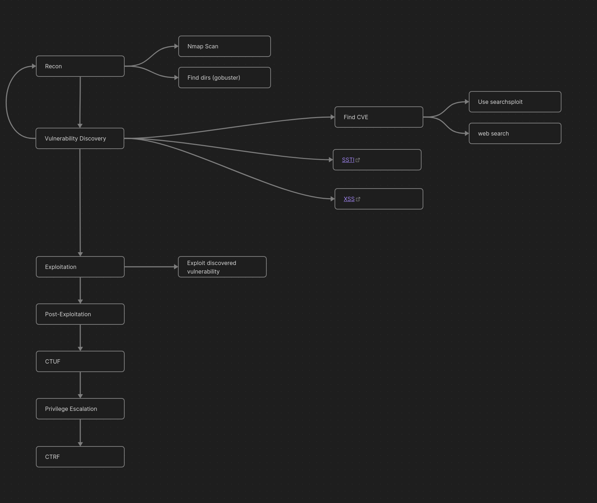
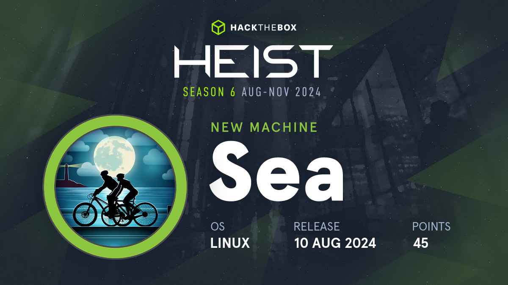

# My Methodology

# Timeline

### 21st Oct 2024

- Started sea - [README](https://hexadivine.gitbook.io/hd/ctf-walkthoughs/hackthebox/sea) [HTB](https://app.hackthebox.com/machines/Sea)
- Status - In process (Exploitation)
- Things learnt - 
	- It is important to perform through recon. Specially if it is a web app, get all possible/available/important **files/dirs**. This helps to move forward and find vulnerability. 

### 20th Oct 2024

- Started Sightless - [README](https://hexadivine.gitbook.io/hd/ctf-walkthoughs/hackthebox/sightless) [HTB](https://app.hackthebox.com/machines/Sea)
- Status - In process (Privilege Escalation)
- Things learnt - 
	- After exploitation look for hashes that can be cracked by john for ssh access to user.
