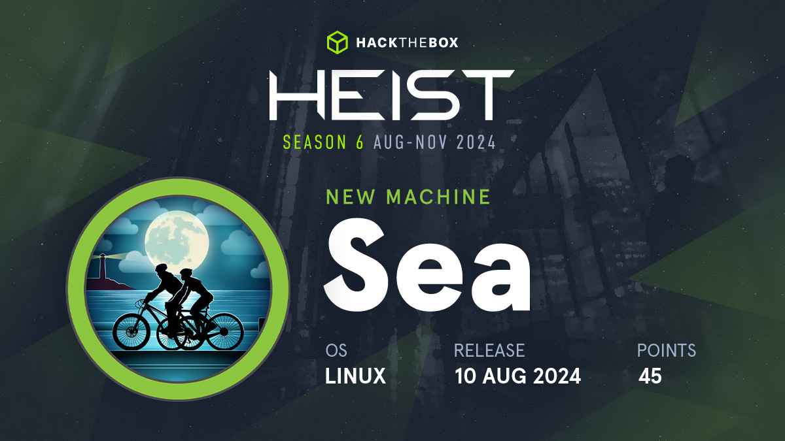

###### [link](https://app.hackthebox.com/machines/Sea)

# [Recon]()

- nmap scan

> nmap -sCSV -T4 $ip
```
Starting Nmap 7.94SVN ( https://nmap.org ) at 2024-10-21 16:15 AEDT
Nmap scan report for sea.htb (10.10.11.28)
Host is up (0.30s latency).
Not shown: 998 closed tcp ports (reset)
PORT   STATE SERVICE VERSION
22/tcp open  ssh     OpenSSH 8.2p1 Ubuntu 4ubuntu0.11 (Ubuntu Linux; protocol 2.0)
| ssh-hostkey: 
|   3072 e3:54:e0:72:20:3c:01:42:93:d1:66:9d:90:0c:ab:e8 (RSA)
|   256 f3:24:4b:08:aa:51:9d:56:15:3d:67:56:74:7c:20:38 (ECDSA)
|_  256 30:b1:05:c6:41:50:ff:22:a3:7f:41:06:0e:67:fd:50 (ED25519)
80/tcp open  http    Apache httpd 2.4.41 ((Ubuntu))
|_http-title: Sea - Home
| http-cookie-flags: 
|   /: 
|     PHPSESSID: 
|_      httponly flag not set
|_http-server-header: Apache/2.4.41 (Ubuntu)
Service Info: OS: Linux; CPE: cpe:/o:linux:linux_kernel

Service detection performed. Please report any incorrect results at https://nmap.org/submit/ .
Nmap done: 1 IP address (1 host up) scanned in 9.55 seconds
```

- checking website on sea.htb


- found http://sea.htb/contact.php


# [Vulnerability Discovery]()

- no vulnerability in ssh version
- no vulnerability in apache version
- checking contact.php page for xss & sqli - unsuccessful


# [Recon]() 

- Brut forcing files and dirs
- Eventually found something

> ffuf -u http://sea.htb/themes/bike/FUZZ -w /usr/share/wordlists/dirb/common.txt -e .md,.txt,.php -mc 200

```

        /'___\  /'___\           /'___\       
       /\ \__/ /\ \__/  __  __  /\ \__/       
       \ \ ,__\\ \ ,__\/\ \/\ \ \ \ ,__\      
        \ \ \_/ \ \ \_/\ \ \_\ \ \ \ \_/      
         \ \_\   \ \_\  \ \____/  \ \_\       
          \/_/    \/_/   \/___/    \/_/       

       v2.1.0-dev
________________________________________________

 :: Method           : GET
 :: URL              : http://sea.htb/themes/bike/FUZZ
 :: Wordlist         : FUZZ: /usr/share/wordlists/dirb/common.txt
 :: Extensions       : .md .txt .php 
 :: Follow redirects : false
 :: Calibration      : false
 :: Timeout          : 10
 :: Threads          : 40
 :: Matcher          : Response status: 200
________________________________________________

404                     [Status: 200, Size: 3341, Words: 530, Lines: 85, Duration: 499ms]
home                    [Status: 200, Size: 3650, Words: 582, Lines: 87, Duration: 655ms]
LICENSE                 [Status: 200, Size: 1067, Words: 152, Lines: 22, Duration: 660ms]
README.md               [Status: 200, Size: 318, Words: 40, Lines: 16, Duration: 191ms]
summary                 [Status: 200, Size: 66, Words: 9, Lines: 2, Duration: 552ms]
version                 [Status: 200, Size: 6, Words: 1, Lines: 2, Duration: 191ms]
:: Progress: [18456/18456] :: Job [1/1] :: 232 req/sec :: Duration: [0:02:52] :: Errors: 0 ::
```

- checking  http://sea.htb/themes/bike/README.md

```
# WonderCMS bike theme

## Description
Includes animations.

## Author: turboblack

## Preview


## How to use
1. Login to your WonderCMS website.
2. Click "Settings" and click "Themes".
3. Find theme in the list and click "install".
4. In the "General" tab, select theme to activate it.
```

- checking http://sea.htb/themes/bike/version

```
3.2.0
```

# [Vulnerability Discovery]()

- Searching vulnerability for WonderCMS bike theme v 3.2.0 
- Vulnerability found - https://github.com/prodigiousMind/CVE-2023-41425

# [Exploit]()

- not able to exploit it...TBD...


# Personal Learnings

- It is important to perform through recon. Specially if it is a web app, get all possible/available/important **files/dirs**. This helps to move forward and find vulnerability.