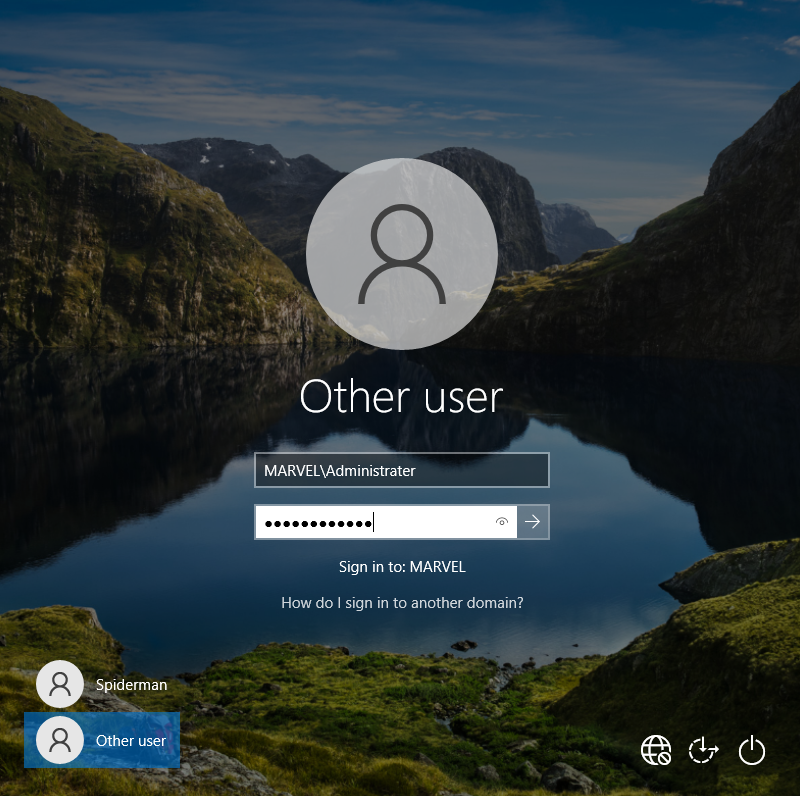

# [Requirements]()

- Download [windows server 2022](https://www.microsoft.com/en-us/evalcenter/download-windows-server-2022), [windows enterprise](https://www.microsoft.com/en-us/evalcenter/download-windows-10-enterprise) and virtual box.
- It is required to have these VMs: 1 windows server, and 2 windows 10 enterprise clients on same network, hence update the network tab to below after creating VMs.


# [Installation]()
## [Windows Server 2022]()

- While creating windows server 2022 on virtual box click on skip unattended installation to manually install.


- click on custom install


- click on new and apply


- After successful install of windows server 2022 it should look like below.


- Now the windows server 2022 has been successfully installed.

## [Windows 10 Enterprise]()

- Similar to windows servers installation keep the skip unattended installation ticked and finish (make sure it has proper network configuration mentioned in the requirements section)


- Click on custom install


- Click on `Domain join instead`


- After this windows 10 will boot. Follow the same process to create new user named `Ironman`
# [Setup]()

## [Windows server 2022 (DC)]()

### [Change PC name]()

- setup the windows server name to `DC` (domain controller)


- After reboot configure the adaptor to update the name and assign static IP


### [Setup adaptor]()

- After clicking on change adaptor option right click on Ethernet and rename to `internal` for better understanding.


- After changing name update the properties by right click on `internal` adaptor > properties > Internet Protocol version 4 > properties


- Change the setting to below.

```
IP address: 192.168.0.2
Subnet mask: 255.255.255.0
Default gateway: 192.168.0.1

Preferred DNS Server: 127.0.0.1
```


### [Setup AD DS]()

- Click on manage > add roles and features.


- Click on Active Directory Domain Services and Add Features.


- Click on promote this server to domain controller.


### [Setup certificate services]()

- manage > add roles > click next 3 times > select ADCS as shown below


- Keep defaults and click next till you see below and click install.


- Click on Configure AD CS on the destination server.


- Click on configure


### [Add Groups OU]()

- First step we'll do is we will create `Groups` OU (organisational unit) and move all the security groups from `Users` to `Groups`
- Click Tools > AD Users and computers.


- Create new Organisational Unit called `Groups.


- Select `Security Groups` and move to `Groups` OU


- Note: logo near Guest shows it is disabled.

### [Create users]()

- In this scenario we will copy administrator to create new user and save some time. (This is a big **no no** as copied user will get all admin access which is dangerous.)
- Right click on Administrator and click copy


- Similarly we will create a new service user called `SQLService` by coping administrator.


- After this we will create low privileged users. 
- Click New > User create `Tony Stark` and `Peter Parker`


- Finally it should look like below.


### [Setup File share]()

- Go to File and storage Services > Shares > Tasks > New Share


### [Setup SPN]()

The `setspn` command is used to manage Service Principal Names for accounts in Active Directory. SPNs are unique identifiers for services running on servers, allowing clients to authenticate to those services using Kerberos authentication.

```
setspn -a MARVAL/SQLService.MARVAL.local:60111 AVENGERS\SQLService
```


- `-a`: This option is used to add a new SPN.
- `MARVAL/SQLService.MARVAL.local:60111`: This specifies the SPN being added. It follows the format `serviceclass/hostname:port`, where:
    - **serviceclass**: Indicates the type of service (e.g., MARVAL).
    - **hostname**: The fully qualified domain name (FQDN) of the server hosting the service.
    - **port**: The port number on which the service is listening (in this case, 60111).
- `AVENGERS\SQLService`: This is the account (user or computer) to which the SPN is being assigned

### [Setup Group Policy]()

- For this lab we will disable Microsoft firewall to launch various attacks (not safe). This policy will be pushed to entire domain.


- Right click on domain and click Create a GPO in this domain...


- Right click on newly created GPO and click Edit


- Double click on `Turn off Microsoft Defender Antivirus` click `enabled` and apply.


- After this close and click on enforced


- Windows servers has been successfully setup.

## [Windows 10 Enterprise (Client)]()

### [Change adaptor settings]()

- Follow the same process as mentioned above and change the IP to below

```
IP address: 192.168.0.3
Subnet mask: 255.255.255.0
Default gateway: 192.168.0.1

Preferred DNS Server: 192.168.0.2 (DC ip address)
```


### [Login to domain]()

- Search for domain > connect.


- We will click on `Join this device to a local AD domain`


- After this restart the device and login to to `MARVEL\Administrator` account.


- We can confirmed that the clients are connected from DC


### [Update local users and groups]()

- Update local groups and users on both `spiderman` and `ironman` VM. For this; on `spiderman` VM, login to `MARVEL\Administrator` account.



- Search edit local user and groups


- Set password for Administrator


- After setting the password double click on `Administrator` and on click on `Account is disabled` to unselect and apply (In best practice scenarios it should be disabled.)


- After this add `pparker` to local administrator group.


- Click on add and search for `pparker` and click on check names. 


- After this click on ok to add the user to local admin group. 
- Similarly add `tstark` to `spiderman` vm (for further attack vectors)


- You should see below. Next, click on apply.


- In the `ironman` VM follow same process (login to `MARVEL\Administrator` on `ironman` VM, change admin password and enable it as shown for `spiderman` VM) 

- In the `Administrator Properties` window for `Ironman` VM add only `tstark`.
- It should look like below on `ironman` VM.


### [Map network drive]()

- Login to `.\spiderman`


- Here we will map a network drive for further attack vectors.


- The setup is now completed.