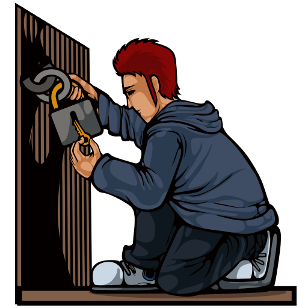

## Introduction

**Active recon** requires you to interact with target to gather the information. This contact can be a phone call or a visit to the target company under some pretence to gather more information, usually as part of social engineering. Alternatively, it can be a direct connection to the target system, whether visiting their website or checking if their firewall has an SSH port open. Think of it like you are closely inspecting windows and door locks. Hence, it is essential to remember not to engage in active reconnaissance work before getting signed legal authorization from the client.